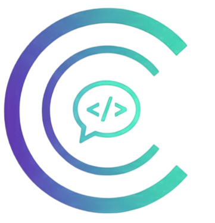

<div align="center">
  <a href="https://cod-chat-nine.vercel.app">
  
  
  <h1>CodChat – Real-time Project Collaboration Platform</h1>
  </a>
</div>

A real-time collaborative platform for developers to work together on projects. Users can create project rooms, add collaborators, and chat instantly while coding. CodChat integrates AI assistance directly into the chat, helping developers solve problems, generate code, and debug without leaving the discussion. It improves team programming and collaboration.

<br>
<p align="center">
  <a href="https://cod-chat-nine.vercel.app/" target="_blank">
    
  </a>
</p>

<!-- [](https://github.com/vaibhavVS18/CodChat) -->

## 🌟 Features

### Team Collaboration
- Create project rooms for your team
- Invite team members and work together in real-time
- Add and manage collaborators on projects
- Session persistence for ongoing work

### Integrated Chat
- Real-time messaging with team members
- Chat directly within the platform while coding
- Chat history storage for project continuity
- Instant message delivery with Socket.io

### AI Assistant
- Type `@ai` before your message to get AI help
- Code generation and suggestions
- Debugging assistance
- Problem-solving support without leaving the chat
- Powered by OpenAI API

## 🛠️ Tech Stack

**Frontend:**
- React
- Socket.io (client)

**Backend:**
- Node.js
- Express
- MongoDB
- Socket.io (server)
- JWT Authentication
- OpenAI API

## 🚀 Getting Started

### Prerequisites
- Node.js
- MongoDB
- OpenAI API key

### Installation

1. **Clone the repository**
```bash
git clone https://github.com/vaibhavVS18/CodChat.git
cd CodChat
```

2. **Install dependencies**
```bash
# Install frontend dependencies
cd client
npm install

# Install backend dependencies
cd ../server
npm install
```

3. **Set up environment variables**

Create `.env` files in both client and server directories with your configuration (MongoDB URI, JWT Secret, OpenAI API Key).

4. **Run the application**
```bash
# Start backend
cd server
npm start

# Start frontend (in new terminal)
cd client
npm run dev
```

## 🌐 Live Demo

**Live Application**: [https://cod-chat-nine.vercel.app/](https://cod-chat-nine.vercel.app/)

## 👨‍💻 Author

**Vaibhav** - [@vaibhavVS18](https://github.com/vaibhavVS18)

---

**Made with ❤️ for better developer collaboration**
